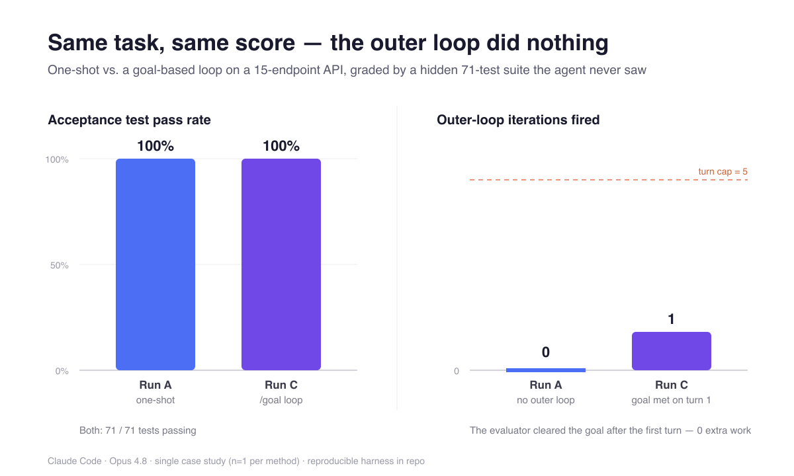
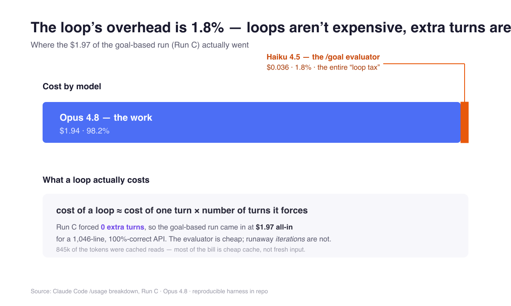

# Loop Engineering Experiment

A controlled experiment comparing four ways of working with an AI coding agent
(Claude Code, Opus 4.8) on the **same task**, measuring cost, time, quality,
and human effort — to answer one question with real data:

> **When does a feedback loop pay off, and when is it wasted time, money, or complexity?**

This repository is the reproducible companion to a Medium article on
**Loop Engineering** — the June 2026 shift from prompting agents by hand to
designing the loops that prompt them (Osmani, Steinberger, Cherny; formalized
by Anthropic's ["Getting Started with Loops"](https://claude.com/blog/getting-started-with-loops)).

## The experiment

The same task — build a **Task Manager REST API** from [`spec/SPEC.md`](spec/SPEC.md) —
is given to the agent four times, once per loop type in Anthropic's taxonomy:

| Run | Method | Loop type | Human role |
|-----|--------|-----------|------------|
| **A** | Single prompt, no iteration allowed | One-shot (baseline) | Sends 1 prompt, waits |
| **B** | Human relays failure output each turn | Turn-based loop | Verification loop is the human |
| **C** | `/goal` with verifiable stop condition | Goal-based loop | Sets the goal, walks away |
| **D** | `/loop` + self-verification skill | Time-based / autonomous loop | Designs the loop, walks away |

Each run happens in a **fresh directory and a fresh session** (clean context).

## Scoring — the hidden acceptance suite

Quality is measured by a **black-box acceptance test suite**
([`harness/acceptance_tests/`](harness/acceptance_tests/)) that exercises the
API over HTTP. The agent **never sees these tests** — this prevents
overfitting/reward-hacking and makes the pass-rate an honest signal.

## Metrics collected per run

| Metric | Source |
|--------|--------|
| Acceptance test pass rate (%) | `harness/run_tests.sh` |
| Tokens (input/output) & cost ($) | Claude Code `/usage` + session stats |
| Wall-clock time | Recorded start/end |
| Turns / iterations | Session transcript |
| Human interventions (count) | Manual log in `results/` |
| Code-review findings | `/code-review` on final diff |
| Scope creep | Files/behavior outside the spec |

## Results at a glance

Two of the four runs were executed (budget — see the article); both scored a
perfect **71/71** and the goal-based outer loop fired **zero** extra iterations.





| | Run A (one-shot) | Run C (`/goal`) |
|---|---|---|
| Acceptance score | **71/71 (100%)** | **71/71 (100%)** |
| Outer-loop iterations | 0 | 1 (cap 5; 0 extra) |
| All-in cost | fragmented across sessions* | **$1.97** |
| `/goal` evaluator overhead | — | $0.036 (1.8%) |
| App code | 805 LOC | 1046 LOC |

\* Run A was split across sessions by usage-limit pauses; see `results/run-A.md`.

## Read the write-up

- 🇬🇧 [`article/loop-engineering-EN.md`](article/loop-engineering-EN.md)
- 🇹🇷 [`article/loop-engineering-TR.md`](article/loop-engineering-TR.md)

## Reproducing

1. Read [`PROTOCOL.md`](PROTOCOL.md) — the exact steps, prompts, and honesty rules.
2. Each run's final code lives in `runs/run-*/`.
3. Raw metrics and per-run logs live in `results/`.
4. Score any run:
   ```bash
   ./harness/run_tests.sh runs/run-C-goal
   ```
   (creates its own throwaway venvs; needs Python 3 and `curl`).

## Honesty rules (summary)

- The acceptance suite is never shown to the agent, in any run.
- Failed runs are reported as failures, not retried until they look good.
- All prompts used are recorded verbatim in `PROTOCOL.md` / `results/`.
- One model (Opus 4.8), one machine, same day-range for all runs.
